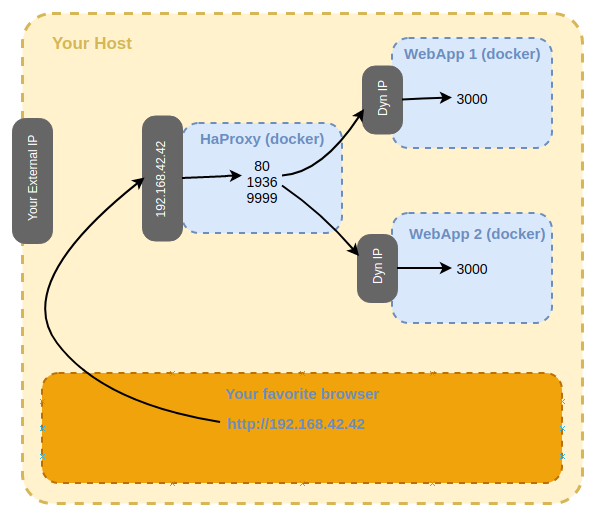
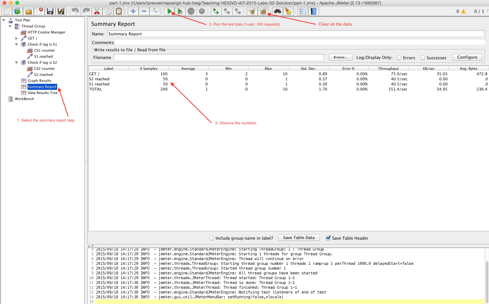
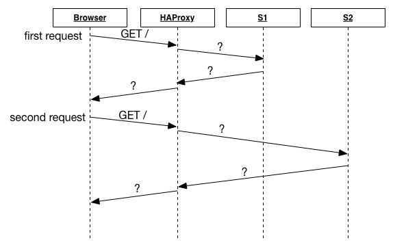
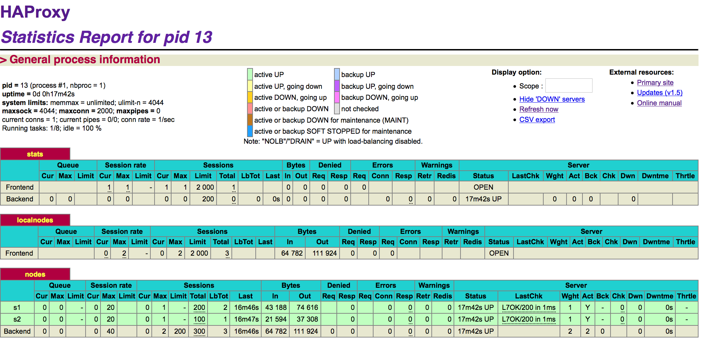

title: Lab 03 - Load balancing
---

## Lab 03 - Load balancing


#### Pedagogical objectives

* Deploy a web application in a two-tier architecture for scalability

* Configure a load balancer

* Performance-test a load-balanced web application

In this lab you will perform a number of tasks and document your
progress in a lab report. Each task specifies one or more deliverables
to be produced.  Collect all the deliverables in your lab report. Give
the lab report a structure that mimics the structure of this document.

**Remarks**:

  - Use the Task numbers and question numbers in reference in your report.

  - The version of HAProxy used in this lab is `2.2`. When reading the doc, take care to read the doc corresponding to this version. Here is the link: http://cbonte.github.io/haproxy-dconv/2.2/configuration.html

  - During the lab, you will have to modify and play a bit with the [haproxy.cfg](ha/config/haproxy.cfg) file. You will find all the reference links to the official documentation inlined in the file.

### Task 1: Install the tools

In this part you will install the base tools you need to do the
different tasks of this lab.

Install on your local machine Docker to create containers and install Docker-compose to your running multi-container. We provide all the Dockerfiles. Install also JMeter for load testing web applications:

* [Docker](https://www.docker.com/)
* [Docker compose](https://docs.docker.com/compose/)
* [JMeter](http://jmeter.apache.org/)

Clone the following repository to your machine:

https://github.com/SoftEng-HEIGVD/Teaching-HEIGVD-AIT-2019-Labo-Load-Balancing.git

Normally your folder should look like this :

```
Teaching-HEIGVD-AIT-2019-Labo-02/
├── assets/
│   └── ...
|
├── ha/
│   ├── config/
|   |   ├── haproxy.cfg
|   |   └── rsyslogd.cfg
|   |
│   ├── scripts/
|   |   ├── run-deamon.sh
|   |   └── run.sh
|   └── Dockerfile
|  
├── webapp/
|   ├── app/
|   │   └── ...
|   ├── run.sh
|   └── Dockerfile
|
├── docker-compose.yml
├── Docker quick reference.md
├── README.md
├── .env
└── tester.jmx
```

We are going to create three docker containers. One contains HAProxy, the other two contain each a sample
web application.

The containers with the web application stand for two web servers that
are load-balanced by HAProxy.

To create the containers we use docker-compose. Execute this command on the main folder

`$ docker-compose up --build`

You should see output similar to the following:

```bash
Creating network "teaching-heigvd-ait-2019-labo-load-balancing_public_net" with driver "bridge"
Building webapp1
Step 1/9 : FROM node:latest
 ---> d8c33ae35f44
Step 2/9 : MAINTAINER Laurent Prevost <laurent.prevost@heig-vd.ch>
 ---> Using cache
 ---> 0f0e5f2e0432
Step 3/9 : RUN apt-get update && apt-get -y install wget curl vim && apt-get clean && npm install -g bower
[...]
Creating s1 ... done
Creating s2 ... done
Creating ha ... done
```

You can verify that you have 3 running containers with the following command:

`$ docker ps`

You should see output similar to the following:

```
CONTAINER ID        IMAGE                                                  COMMAND                  CREATED             STATUS              PORTS                    NAMES
a37cd48f28f5        teaching-heigvd-ait-2019-labo-load-balancing_webapp2   "docker-entrypoint.s…"   2 minutes ago       Up About a minute   0.0.0.0:4001->3000/tcp   s2
8e3384aec724        teaching-heigvd-ait-2019-labo-load-balancing_haproxy   "/docker-entrypoint.…"   2 minutes ago       Up 2 minutes        0.0.0.0:80->80/tcp       ha
da329f9d1ab6        teaching-heigvd-ait-2019-labo-load-balancing_webapp1   "docker-entrypoint.s…"   2 minutes ago       Up 2 minutes        0.0.0.0:4000->3000/tcp   s1
```

You can verify that you have a network bridge that connects the containers with the following command:

`$ docker network ls`

The two web app containers stand for two web servers. They run a
NodeJS sample application that implements a simple REST API. Each
container exposes TCP port 3000 to receive HTTP requests.

The HAProxy load balancer is listening on TCP port 80 to receive HTTP
requests from users. These requests will be forwarded to and
load-balanced between the web app containers. Additionally it exposes
TCP ports 1936 and 9999 which we will cover later.

The architecture of our distributed web application is shown in the
following diagram:



You can now navigate to the address of the load balancer
<http://192.168.42.42> in your favorite browser. The load balancer
forwards your HTTP request to one of the web app containers.

In the case the previous link does not work, you can access the load balancer
with <http://localhost:80>. If you need to use this address, you will have
to adapt the laboratory to use this address.

Both containers run the same simple test web app. It is modeled as a
REST resource. To make this lab more "interesting" the app uses
sessions. The app is written in Node.js and uses a cookie named
`NODESESSID`.

The app returns an HTTP response with a JSON payload that is designed
to help you with testing and debugging. You should see output similar
to the following:

```json
{
  "hello": "world!",
  "ip": "172.17.0.7",
  "host": "2b277f0fe8da",
  "tag": "s1",
  "sessionViews": 1,
  "id": "pdoSpuStaotzO4us2l_uYArG0w6S57eV"
}
```

The fields have the following meaning:

* The field `ip` contains the internal IP address of the
  container. This allows you to identify the container, as each
  receives a different IP address from Docker.

* The field `host` is the hostname of the container and in the Docker
  context this represents the container ID.

* The `tag` represents the server tag corresponding, in our case, to
  the container name (docker **--name s1**).

* The field `sessionViews` returns a counter that is a session
  variable. The counter is incremented each time the app receives a
  request.  **Hint**: Use this field to observe the session behavior
  of the load balancer.

* Finally, the field `id` is the session id. You should be able to
  find that same session id embedded in the session cookie that is
  sent to the client.

Now it's time to play a bit with what we did until now.

Open JMeter and then open the script `tester.jmx` present in the root
folder of the project and follow the instructions given in the
following screenshot (Click on the image and then on RAW button to see the picture in full size. Useful to read the text):



The JMeter test plan is set up in the following way:

* A Thread Group simulates one user making one hundred GET requests to
  <http://192.168.42.42/>.

* An HTTP Cookie Manager is active on the Thread Group that will send
  back in the HTTP request any cookies received in previous responses.

* The server tag is extracted from the HTTP response and used for two
  counters, CS1 and CS2, that are incremented each time the response
  came from web app S1 or S2, respectively.

* The Summary Report shows the counters ("S1 reached" / "S2 reached")
  and the total counts.


**Deliverables:**

1. Explain how the load balancer behaves when you open and refresh the
    URL <http://192.168.42.42> in your browser. Add screenshots to
    complement your explanations. We expect that you take a deeper a
    look at session management.

2. Explain what should be the correct behavior of the load balancer for
    session management.

3. Provide a sequence diagram to explain what is happening when one
    requests the URL for the first time and then refreshes the page. We
    want to see what is happening with the cookie. We want to see the
    sequence of messages exchanged (1) between the browser and HAProxy
    and (2) between HAProxy and the nodes S1 and S2. Here is an example:

  

4. Provide a screenshot of the summary report from JMeter.

5. Run the following command:

  ```bash
  $ docker stop s1
  ```

  Clear the results in JMeter and re-run the test plan. Explain what
  is happening when only one node remains active. Provide another
  sequence diagram using the same model as the previous one.


### Task 2: Sticky sessions

It's time to go further. At this stage, we now have a load balanced
web application but the session management is totally messed up. In
this task your job is to fix the configuration of HAProxy to enable
sticky session management.

For that, you will have to play with docker a little bit more. You
might want to consult the file [Docker quick reference](Docker quick reference.md) for some
useful commands and hints.

**Deliverables:**

1. There is different way to implement the sticky session. One possibility is to use the SERVERID provided by HAProxy. Another way is to use the NODESESSID provided by the application. Briefly explain the difference between both approaches (provide a sequence diagram with cookies to show the difference).

  * Choose one of the both stickiness approach for the next tasks.

2. Provide the modified `haproxy.cfg` file with a short explanation of
    the modifications you did to enable sticky session management.

3. Explain what is the behavior when you open and refresh the URL
    <http://192.168.42.42> in your browser. Add screenshots to
    complement your explanations. We expect that you take a deeper a
    look at session management.

4. Provide a sequence diagram to explain what is happening when one
    requests the URL for the first time and then refreshes the page. We
    want to see what is happening with the cookie. We want to see the
    sequence of messages exchanged (1) between the browser and HAProxy
    and (2) between HAProxy and the nodes S1 and S2. We also want to see
    what is happening when a second browser is used.

5. Provide a screenshot of JMeter's summary report. Is there a
    difference with this run and the run of Task 1?

  * Clear the results in JMeter.

  * Now, update the JMeter script. Go in the HTTP Cookie Manager and
    <del>uncheck</del><ins>verify that</ins> the box `Clear cookies each iteration?`
    <ins>is unchecked</ins>.

  * Go in `Thread Group` and update the `Number of threads`. Set the value to 2.

7. Provide a screenshot of JMeter's summary report. Give a short
    explanation of what the load balancer is doing.


### Task 3: Drain mode

HAProxy provides a mode where we can set a node to DRAIN state. In
this case, HAProxy will let _current_ sessions continue to make
requests to the node in DRAIN mode and will redirect all other traffic
to the other nodes.

In our case, it means that if we put `s1` in DRAIN mode, all new
traffic will reach the `s2` node and all current traffic directed to
`s1` will continue to communicate with `s1`.

Another mode is MAINT mode which is more intrusive than DRAIN. In this
mode, all current and new traffic is redirected to the other active
nodes even if there are active sessions.

In this task, we will experiment with these two modes. We will base
our next steps on the work done on Task 2. We expect you have a
working Sticky Session configuration with two web app nodes up and
running called `s1` and `s2`.

When all the infra is up and running, perform the following steps:

1. Open a browser on your host

2. Navigate to `http://192.168.42.42`. You will reach one of the two
   nodes. Let's assume it is `s1` but in your case, it could be `s2`
   as the balancing strategy is roundrobin.

3. Refresh the page. You should get the same result except that the
   views counter is incremented.

4. Refresh multiple times the page and verify that you continue to
   reach the same node and see the sessionViews counter increased.

5. In a different tab, open `http://192.168.42.42:1936` and take a
   look. You should have something similar to the following
   screenshot.



  You should be able to see the `s1` and `s2` nodes and their state.

For the next operations, you will use HAProxy's built-in command line
to query its status and send commands to it. HAProxy provides the
command line via a TCP socket so that a system administrator is able
to connect to it when HAProxy runs on a remote server. You will use
`socat` to connect to the TCP socket. `socat` is a universal
command-line tool to connect pretty much anything with anything. You may need to install it

To use it type the following:

```bash
$ socat - tcp:192.168.42.42:9999
prompt

> help
Unknown command. Please enter one of the following commands only :
  clear counters : clear max statistics counters (add 'all' for all counters)
  clear table    : remove an entry from a table
  help           : this message
  prompt         : toggle interactive mode with prompt
  quit           : disconnect
  show info      : report information about the running process
[...]
```

After typing `socat - tcp:localhost:9999` and pressing enter you will
see... nothing. You are connected to HAProxy, but it remains silent
for the time being. You have to turn on the prompt by typing
`prompt`. You will see a new line starting with `>`. Now you can enter
commands that will be directly interpreted by HAProxy.

First, increase the client timeout to avoid losing connections.

```bash
> set timeout cli 1d
```

Now, to set a node's state to `ready`, `maint` or `drain`, enter the
following command:

```bash
> set server nodes/<containerName> state <state>
```

**Note:** In fact, the `nodes` is the group of backend nodes
  labelled. You will find the corresponding `backend nodes` in ha
  config.

**Note 2:** The containerName is the label of the node. In fact, in
this lab, we used the same name as Docker container names but both
names are not linked together. We can choose different names if we
want. The name set in this command is the name present in the HAProxy
admin stats interface (or also found in the config file).

**Note 3:** We will use only the three states presented there. Take
  care that the command only accept lower cases states.

**Deliverables:**

1. Take a screenshot of the Step 5 and tell us which node is answering.

2. Based on your previous answer, set the node in DRAIN mode. Take a
    screenshot of the HAProxy state page.

3. Refresh your browser and explain what is happening. Tell us if you
    stay on the same node or not. If yes, why? If no, why?

4. Open another browser and open `http://192.168.42.42`. What is
    happening?

5. Clear the cookies on the new browser and repeat these two steps
    multiple times. What is happening? Are you reaching the node in
    DRAIN mode?

6. Reset the node in READY mode. Repeat the three previous steps and
    explain what is happening. Provide a screenshot of HAProxy's stats
    page.

7. Finally, set the node in MAINT mode. Redo the three same steps and
    explain what is happening. Provide a screenshot of HAProxy's stats
    page.

### Task 4: Round robin in degraded mode.

In this part, we will try to simulate a degraded mode based on the round-robin previously configured.

To help experimenting with load balancing when an application starts to behave strangely, the web application
has a REST resource to configure a delay in the response. You can set
an arbitrary delay in milliseconds. Once the delay is configured, the
response will take the amount of time configured.

To set the timeout, you have to do a `POST` request with the following
content (be sure the `Content-Type` header is set to
`application/json`. The configuration is applicable on each
node. Therefore, you can do one `POST` request on
`http://192.168.42.42/delay` and taking a look at the response cookies
will tell you which node has been configured.

```json
{
  "delay": 1000
}
```

The previous example will set a delay of 1 second.

Or retrieve the IP of the container you want to
configure and then do the `curl` command to configure the delay.

```bash
$ docker inspect <containerName>

$ curl -H "Content-Type: application/json" -X POST -d '{"delay": 1000}' http://<containerIp>:3000/delay
```

To reset the delay configuration, just do a `POST` with 0 as the delay
value.

*Remark*: In general, take a screenshot of the summary report in
 JMeter to explain what is happening.

**Deliverables:**

*Remark*: Make sure you have the cookies are kept between two requests.

1. Make sure a delay of 0 milliseconds is set on `s1`. Do a run to have a baseline to compare with in the next experiments.

2. Set a delay of 250 milliseconds on `s1`. Relaunch a run with the
    JMeter script and explain what is happening.

3. Set a delay of 2500 milliseconds on `s1`. Same than previous step.

4. In the two previous steps, are there any errors? Why?

5. Update the HAProxy configuration to add a weight to your nodes. For
    that, add `weight [1-256]` where the value of weight is between the
    two values (inclusive). Set `s1` to 2 and `s2` to 1. Redo a run with a 250ms delay.

6. Now, what happens when the cookies are cleared between each request and the delay is set to 250ms? We expect just one or two sentence to summarize your observations of the behavior with/without cookies.

### Task 5: Balancing strategies

In this part of the lab, you will be less guided and you will have more opportunity to play and discover HAProxy. The main goal of this part is to play with various strategies and compare them.

We propose that you take the time to discover the different strategies in [HAProxy documentation](http://cbonte.github.io/haproxy-dconv/configuration-1.6.html#balance) and then pick two of them (can be round-robin but will be better to chose two others). Once you have chosen your strategies, you have to play with them (change configuration, use Jmeter script, do some experiments).

**Deliverables:**

1. Briefly explain the strategies you have chosen and why you have chosen them.

2. Provide evidence that you have played with the two strategies (configuration done, screenshots, ...)

3. Compare the two strategies and conclude which is the best for this lab (not necessary the best at all).

#### References

* [HAProxy Socket commands (drain, ready, ...)](https://cbonte.github.io/haproxy-dconv/2.2/configuration.html#5.2)
* [Socat util to run socket commands](http://www.dest-unreach.org/socat/)
* [Socat command examples](https://stuff.mit.edu/afs/sipb/machine/penguin-lust/src/socat-1.7.1.2/EXAMPLES)

#### Windows troubleshooting

It appears that Windows users can encounter a `CRLF` vs. `LF` problem when the repo is cloned without taking care of the ending lines. Therefore, if the ending lines are `CRFL`, it will produce an error message with Docker:

```bash
... no such file or directory
```

(Take a look to this Docker issue: https://github.com/docker/docker/issues/9066, the last post show the error message).

The error message is not really relevant and difficult to troubleshoot. It seems the problem is caused by the line endings not correctly interpreted by Linux when they are `CRLF` in place of `LF`. The problem is caused by cloning the repos on Windows with a system that will not keep the `LF` in the files.

Fortunatelly, there is a procedure to fix the `CRLF` to `LF` and then be sure Docker will recognize the `*.sh` files.

First, you need to add the file `.gitattributes` file with the following content:

```bash
* text eol=lf
```

This will ask the repos to force the ending lines to `LF` for every text files.

Then, you need to reset your repository. Be sure you do not have **modified** files.

```bash
# Erease all the files in your local repository
git rm --cached -r .

# Restore the files from your local repository and apply the correct ending lines (LF)
git reset --hard
```

Then, you are ready to go.

There is a link to deeper explanation and procedure about the ending lines written by GitHub: https://help.github.com/articles/dealing-with-line-endings/
